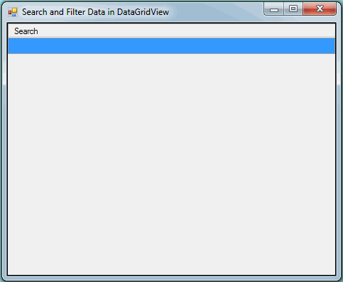

# Search-and-Filter-Data-using-DataGridView-from-Database
This is a WinForm search tool where i have used two datagridview's one for search and another to filter data from database. 

Download - WF_DGV.exe file to see how the tool works.
  
  # HotKeys
  # 1. Enter and Tab Key
  Enter/Tab key is used to select value and to move DGV focus to next row at the same time
  
  # 2. UP Arrow Key
  UP Arrow key is used to move DGV (both search and filter) focus/current cell upward means CurrentRow - 1.
  
  # 3. DOWN Arrow Key
  DOWN Arrow Key is used to move DGV (both search and filter) focus/current cell downward means CurrentRow + 1.
  

Note:
** Use the same keys to go back to previous rows and edit values
